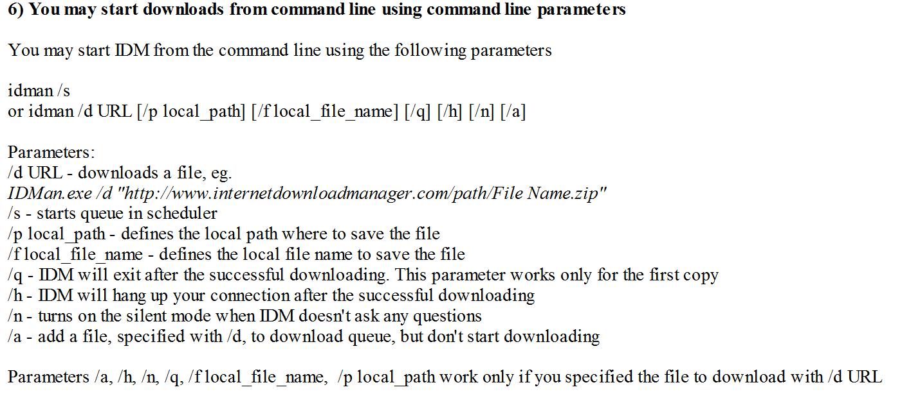

## Command Line

> Refer：IDM -> Help -> Tutorials
>
> Ariticle：Starting Downloads With IDM

### Usage：

~~~ txt
idman /d <URL> /f <file_name> /n /a
idman /s

/n Don't ask any questions for IDM.Use silent mode will be better.
/a Adding a file to download queue but don't start downloading.
/s Start a queue in scheduler
~~~

## Python Project

> Refer：https://pypi.org/project/idm/

