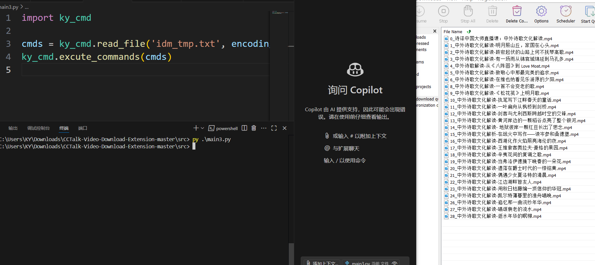
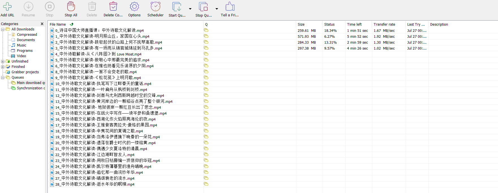

## IDM

## ky_cmd

备注：

- 执行代码前，请提前打开 IDM。

## M3U8

https://github.com/Momo707577045/m3u8-downloader

https://github.com/nilaoda/N_m3u8DL-RE

## N_m3u8DL-RE搭配cat-catch

cat-catch：

- repository: https://github.com/xifangczy/cat-catch
- documentation: https://cat-catch.bmmmd.com/

## Streaming Protocol（流媒体协议）

This content is generated by Deep Seek.

## CoderMJLee/audio-video-dev-tutorial

如果对图片、音频、视频 感兴趣，可以关注 Teacher MJ 的 音视频开发教程。个人推荐，非原作者本意。

audio-video-dev-tutorial：

- repository: https://github.com/CoderMJLee/audio-video-dev-tutorial
- blog: https://www.cnblogs.com/mjios/category/1938094.html

## Aria2

aria2:

- repository: https://github.com/aria2/aria2
- index site: https://aria2.github.io/
- documentation: https://aria2.github.io/manual/en/html/

configuration:

- refer:
  - https://github.com/P3TERX/aria2.conf